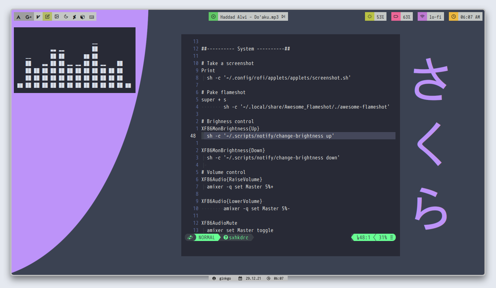
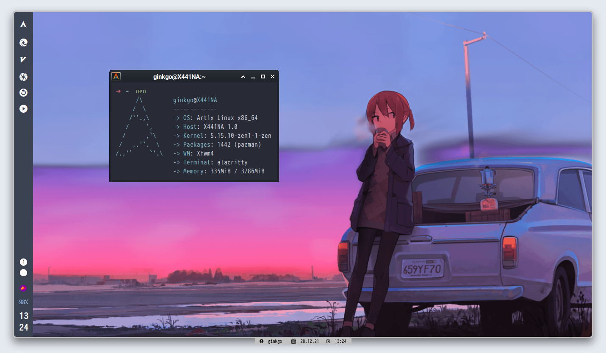

<h1 align="center">My Old bpswm config</h1>

## Bahan-bahan

- WM: bspwm, xfwm4
- Screenshot: scrot, flameshot
- Keybindings: sxhkd
- Terminal: alacritty
- Image viewer: viewnior
- File Manager: thunar, ranger
- Status Bar: polybar, tint2
- Text Editor: neovim
- Set Wallpaper: nitrogen
- Music Player: ncmpcpp
- Icons: papirus custom

## Screenshots

### bspwm

Now play: ~ Haddad alwi - Do'aku

 
 

### xfwm4

 
 

## Notes

Grab whatever you need. Forgive me for messy dotfiles, hehe....

## Special thanks to: 

- [Om Bandithijo](https://bandithijo.github.io) (Flameshot script)
- [Om Berrabe](https://github.com/berrabe) (porting from ruby script to bash)
- [nekonako](https://nekonako.github.io/post/setup-xfwm-standalone) (xfwm4 tutorial)
- [owl4ce](https://github.com/owl4ce) (tint2, xresources)
- [adi1090x](https://github.com/adi1090x) (alacritty config)

